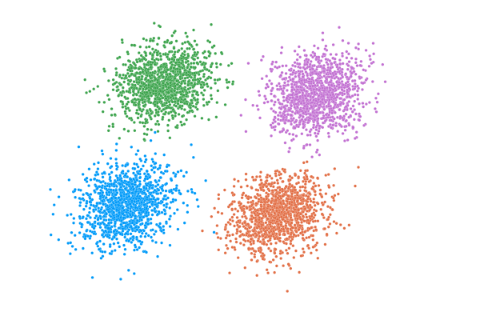
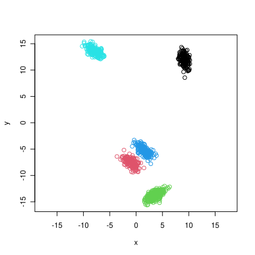
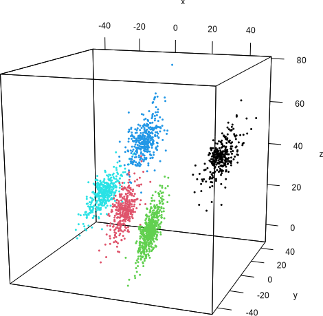

# clugenr 

## Summary

`clugenr` is an [R] package for generating multidimensional clusters. Each
cluster is supported by a line segment, the position, orientation and length of
which guide where the respective points are placed.

## How to install

Install the development version from GitHub with the following command (requires
the [devtools] package):

```R
devtools::install_github("clugen/clugenr")
```

<!--
A stable version of the package is available on [CRAN] and can be installed with
the following instruction:

```R
install.packages("clugenr")
```
-->

## Documentation

All methods and functions are fully documented and can be queried using the
built-in help system. After installation, to access the man pages, invoke the
`clugenr` help page as follows:

```R
help("clugenr")
```

## Examples

### 2D

```R
library(clugenr)
x <- clugen(2, 5, 1000, c(1, -0.5), 0.5, c(4, 6), 6, 0.2, 0.5)
plot(x$points, col = x$point_clusters, xlab = "x", ylab = "y", asp = 1)
```



### 3D

```R
library(clugenr)
library(rgl) # For 3D plots
x <- clugen(3, 5, 2000, c(1, 0.5, -0.7), 0.5, c(15, 10, 20), 15, 3, 10)
plot3d(x$points, col = x$point_clusters, xlab = "x", ylab = "y", zlab = "z", aspect = T)
```



## License

[MIT License](LICENSE)

[R]: https://www.r-project.org/
[devtools]: https://cran.r-project.org/package=devtools
[CRAN]: https://cran.r-project.org/
[pkgdown]: https://pkgdown.r-lib.org/
